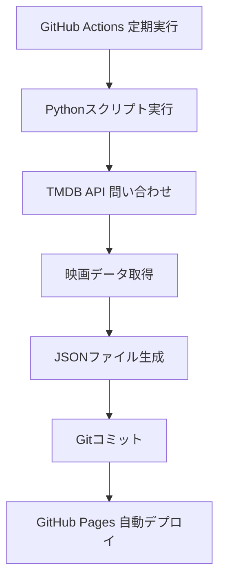

# Movie Database Application - Architecture Design

## 概要

このプロジェクトは、TMDB (The Movie Database) APIから映画データを定期的に取得し、静的Webページとして公開するアプリケーションです。GitHub Pages + GitHub Actionsを活用した完全自動化されたデータ更新システムを採用しています。

## アーキテクチャ

### 全体構成
```
Movie Database Application
├── 📁 scripts/           # Pythonスクリプト（データ取得）
├── 📁 public/           # 静的ファイル（GitHub Pages公開）
├── 📁 config/           # 設定ファイル
├── 📁 docs/            # ドキュメント
├── 📁 .github/         # GitHub Actionsワークフロー
└── 📁 tests/           # テストファイル（将来拡張）
```

### 技術スタック

#### バックエンド（データ取得）
- **言語**: Python 3.9+
- **API**: TMDB API v3
- **ライブラリ**:
  - `requests`: HTTPクライアント
  - `python-dotenv`: 環境変数管理
- **実行環境**: GitHub Actions (Ubuntu)

#### フロントエンド（表示）
- **HTML5/CSS3/JavaScript**: 静的Webページ
- **レスポンシブデザイン**: モバイル対応
- **機能**:
  - 映画ポスターグリッド表示
  - 週別グルーピング
  - ボトムシート（詳細表示）
  - YouTubeビデオ埋め込み

#### インフラ
- **ホスティング**: GitHub Pages
- **CI/CD**: GitHub Actions
- **バージョン管理**: Git
- **設定管理**: GitHub Secrets

## ワークフロー

### 1. データ取得フロー


### 2. 定期実行スケジュール
- **頻度**: 毎週月曜日 00:00 UTC
- **手動実行**: ワークフローディスパッチ可能
- **対象期間**: 当月1ヶ月分の映画データ

### 3. エラーハンドリング
- APIレート制限対応
- ネットワークエラー時のリトライ
- ログ記録（GitHub Actionsログ）
- 失敗時の通知（将来拡張）

## フォルダ構成

```
movie-database/
├── 📄 README.md                 # プロジェクト概要
├── 📄 pyproject.toml           # Python依存関係
├── 📄 uv.lock                 # 依存関係ロックファイル
├── 📄 .python-version         # Pythonバージョン指定
├── 📁 .github/
│   └── 📁 workflows/
│       └── 📄 update-movies.yml # GitHub Actionsワークフロー
├── 📁 scripts/
│   ├── 📄 __init__.py
│   ├── 📄 api.py              # TMDB APIクライアント
│   ├── 📄 fetch_movie.py      # 映画データ取得ロジック
│   └── 📄 batch_fetch.py      # バッチ実行スクリプト
├── 📁 public/                 # GitHub Pages公開ディレクトリ
│   ├── 📄 index.html          # メインHTML
│   ├── 📄 styles.css          # CSSスタイル
│   ├── 📄 script.js           # JavaScriptロジック
│   └── 📄 movies_YYYY_MM.json # 生成されるJSONデータ
├── 📁 config/
│   └── 📄 settings.json       # アプリケーション設定
├── 📁 docs/
│   ├── 📄 ARCHITECTURE.md     # このファイル
│   ├── 📄 API_REFERENCE.md    # API仕様
│   └── 📄 DEPLOYMENT.md       # デプロイ手順
└── 📁 tests/                  # テスト（将来拡張）
    ├── 📄 __init__.py
    └── 📄 test_api.py
```

## 設計原則

### 1. シンプルさ
- 最小限の依存関係
- 静的サイト中心のアーキテクチャ
- サーバーレス設計

### 2. 自動化
- データ更新の完全自動化
- デプロイの自動化
- エラーハンドリングの自動化

### 3. 保守性
- 明確なフォルダ構造
- 包括的なドキュメント
- テスト容易性

### 4. 拡張性
- モジュール化されたコード
- 設定ファイルによる柔軟性
- APIの抽象化

## セキュリティ

### APIキー管理
- TMDB APIキーはGitHub Secretsで管理
- コードにハードコーディングしない
- 環境変数経由でのみアクセス

### データ保護
- 公開データのみ扱う
- 個人情報は含まない
- HTTPS通信のみ

## メンテナンス

### 定期タスク
- 依存関係の更新確認
- API仕様変更の追跡
- パフォーマンス監視

### 監視項目
- GitHub Actions実行結果
- API使用量
- ページアクセス数（Google Analytics等）

### バックアップ
- Gitリポジトリによる自動バックアップ
- 重要な設定ファイルのドキュメント化

## 拡張計画

### Phase 2: 機能拡張
- 検索機能
- フィルタリング機能
- お気に入り機能

### Phase 3: パフォーマンス最適化
- 画像最適化
- キャッシュ戦略
- CDN最適化

### Phase 4: マルチプラットフォーム
- PWA化
- モバイルアプリ
- API提供

## リスクと対策

### リスク1: API制限
**対策**: レート制限遵守、キャッシュ活用、エラーハンドリング

### リスク2: データ鮮度
**対策**: 定期更新、更新失敗時の通知

### リスク3: サイト停止
**対策**: GitHub Pagesの信頼性、バックアップ戦略

---

*最終更新: 2025-12-14*
*作成者: GitHub Copilot*